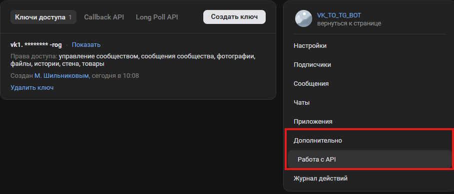
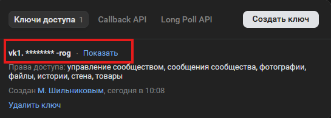

# 📨 VK to TG Bot
> Асинхронный бот для пересылки сообщений из VK (сообщества или диалога) в Telegram

[](https://python.org)
[](https://vk.com/dev)
[](https://core.telegram.org/bots/api)

## ✨ Возможности

- 🔄 Асинхронная пересылка сообщений из VK → Telegram

## 📋 Требования

- Python 3.10+
- [Созданное сообщество ВКонтакте](https://vk.com/groups?act=create)
- [Telegram бот](https://t.me/BotFather)
- Ваш личный Telegram ID (можно получить у [@userinfobot](https://t.me/userinfobot))

---

# ⚠️Важный нюанс⚠️
## Так как тг заблокирован в России коду нужен включеный VPN!

## 🚀 Быстрый старт

### 1️⃣ Создайте сообщество ВКонтакте

Любого типа. После создания перейдите в **Управление** → **Настройки** → вкладка **«Работа с API»**.

<div align="left">
  
</div>

### 2️⃣ Получите токен сообщества

Нажмите **«Создать ключ»**, выберите нужные права (достаточно `разрешения на доступ к сообщениям`) и скопируйте полученный токен.

<div align="left">
  
</div>

### 3️⃣ Настройте Long Poll API

Перейдите на вкладки **«Callback API»** -> **«Long Poll API»**. Включите **Long Poll API** (версия 5.199 и выше).  
В разделе **«Типы событий»** обязательно отметьте:

- ✅ Входящее сообщение

> ⚠️ Убедитесь, что все события, связанные с сообщениями, включены.

### 4️⃣ Скопируйте ID сообщества

ID находится в адресной строке вашего сообщества. Если адрес `https://vk.com/club123456789`, то ID — `123456789`.

<div align="left">
  
</div>

### 5️⃣ Получите ID целевого чата VK

Зайдите в **чат или беседу**, из которой нужно пересылать сообщения.  


<div align="left">
  
</div>

### 6️⃣ Создайте Telegram бота

Напишите [@BotFather](https://t.me/BotFather) команду `/newbot`, выберите имя и username. После создания вы получите **токен бота** — сохраните его.

### 7️⃣ Узнайте свой Telegram ID

Напишите [@userinfobot](https://t.me/userinfobot) и нажмите **Старт**. Бот пришлёт ваш числовой ID.

---

## ⚙️ Конфигурация

Перед запуском создайте файл `.env` в корне проекта:

```env
# Telegram
#TOKEN от BotFather
TG_BOT_TOKEN="Ваш токен"
#Список ID бесед вк, которые слушаем
LIST_OF_LISTEN=1111111111,1111111111
#VK TOKEN
VK_TOKEN="Токен вк"
#ID сообщества в вк которому привязан бот
VK_COMMUNITY_TOKEN=111111111
#ID чата в тг с вашим ботом
CHAT_ID=1111111111